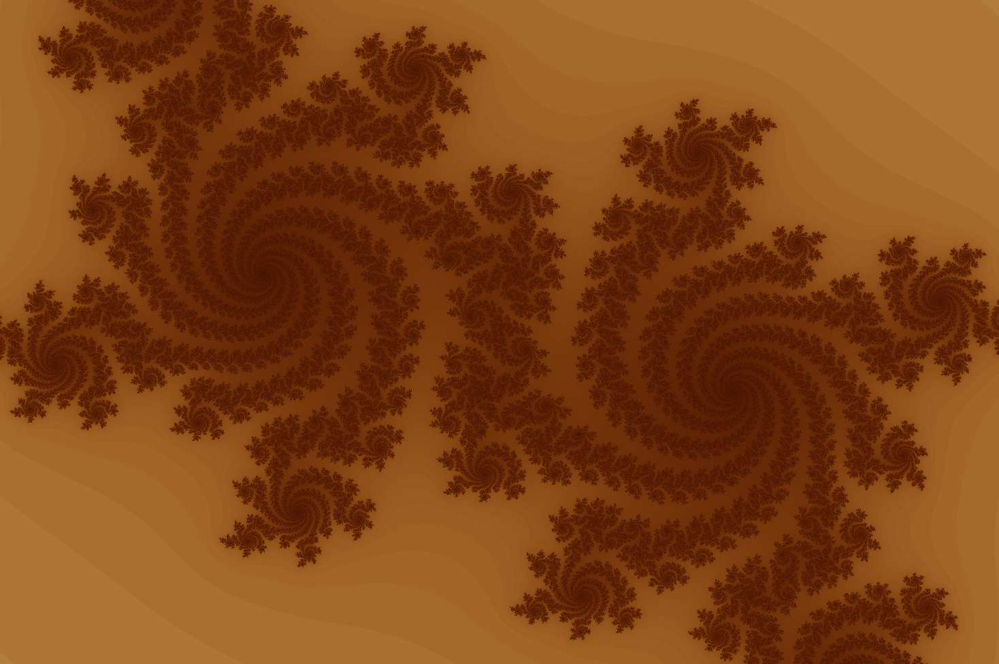

# julia
A simple Julia set visualisation.

## Run
Use `cargo run --release` to run this project.

You may potentially need to install packages for the macroquad dependency to run. If you run into dependency issues look here: [macroquad](https://github.com/not-fl3/macroquad)

Tested on Windows and Linux (Manjaro).

## Julia Sets
Julia Sets describe the borders between areas of convergence for a given function.

Here, we let each pixel's coordinates represent a complex number. The vertical axis is mapped to the imaginary axis of the complex number, and the horizontal coordinate is mapped to the real component. This complex number is then used as the starting value for `z` in the function `f(z) = z^2 + c`. Similarly, the mouse position is mapped to the complex constant `c`.

For each pixel, many iterations of this function are performed, until `z` either diverges or converges. As fractal geometry has infinite detail at its border, the runtime of this algorithm can not be guaranteed. Thus, a hard limit on the number of iterations has also been implemented.

In the resulting visualisation, the color white represents areas of non-divergence. It would normally specifically represent convergence, but due to the hard limit on the number of iterations, we can only guarantee that the value has not diverged yet. The color gradient on the outside shows the divergence speed. Darker colored pixels required more iterations to escape.

More details here: https://en.wikipedia.org/wiki/Julia_set
